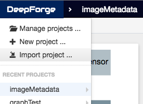
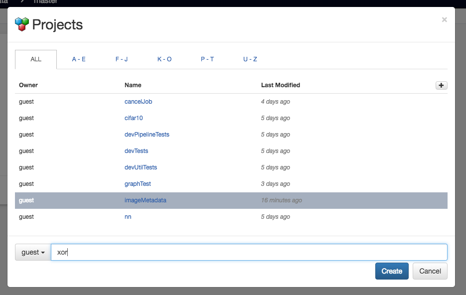
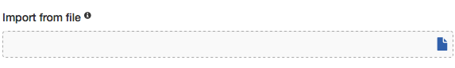
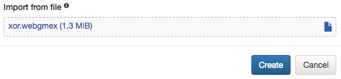

# DeepForge example projects

## Loading Examples
First, you will need to clone the project locally:

```
    git clone https://github.com/dfst/examples
```

Then you can load examples into DeepForge as follows:

1. Select "Import Project"



2. Name the new project



3. Select the file to import



4. Click "Create" to create a new project from the example!


