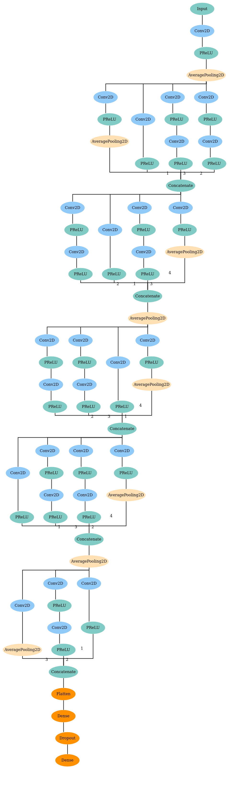

## REDSHIFT 
Redshift is a spectral measurement of how far from the earth the galaxy is moving. The [sdss](https://www.sdss.org/) is a survey conducted by a telescope in the night sky that takes pictures of various regions in the sky. In this example, we present the preprocessing techniques for SDSS images as well as the code to the model presented by this [paper](https://arxiv.org/abs/1806.06607). If you use this model, please cite the paper:
```
@ARTICLE{2019A&A...621A..26P,
       author = {{Pasquet}, Johanna and {Bertin}, E. and {Treyer}, M. and {Arnouts}, S. and
         {Fouchez}, D.},
        title = "{Photometric redshifts from SDSS images using a convolutional neural network}",
      journal = {\aap},
     keywords = {galaxies: distances and redshifts, surveys, methods: data analysis, techniques: image processing, Astrophysics - Instrumentation and Methods for Astrophysics},
         year = "2019",
        month = "Jan",
       volume = {621},
          eid = {A26},
        pages = {A26},
          doi = {10.1051/0004-6361/201833617},
archivePrefix = {arXiv},
       eprint = {1806.06607},
 primaryClass = {astro-ph.IM},
       adsurl = {https://ui.adsabs.harvard.edu/abs/2019A&A...621A..26P},
      adsnote = {Provided by the SAO/NASA Astrophysics Data System}
}
```
Since, the exported webgme project is quite large, you can download it from [here](https://vanderbilt365-my.sharepoint.com/:u:/g/personal/umesh_timalsina_vanderbilt_edu/EZ0ME7hGyUlHqu6n1YmqrIsBdRmfQaKGB1yE7rpHAw5M-w?e=azaP34) and run the pipelines. There are three pipelines as shown in the screen-shot below:


The model designed in deepforge is as follows:




For more details on the implementation please visit this github [repo](https://github.com/umesh-timalsina/redshift).
